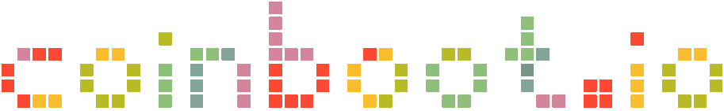
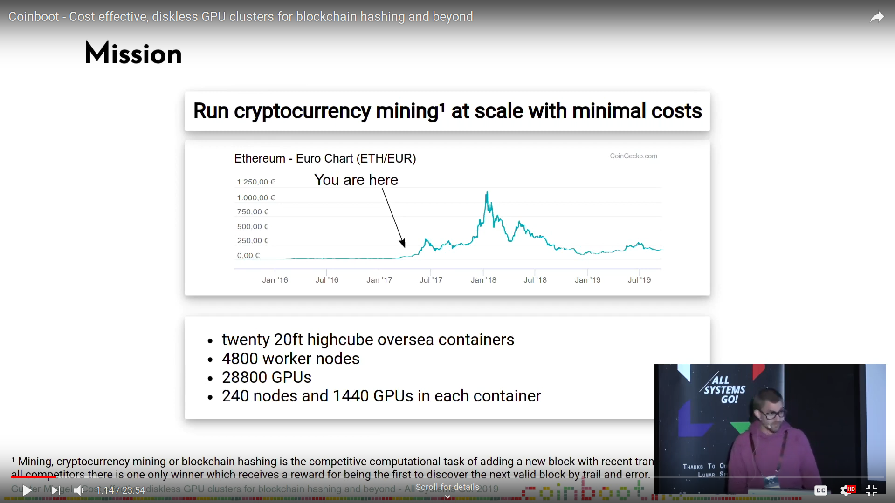
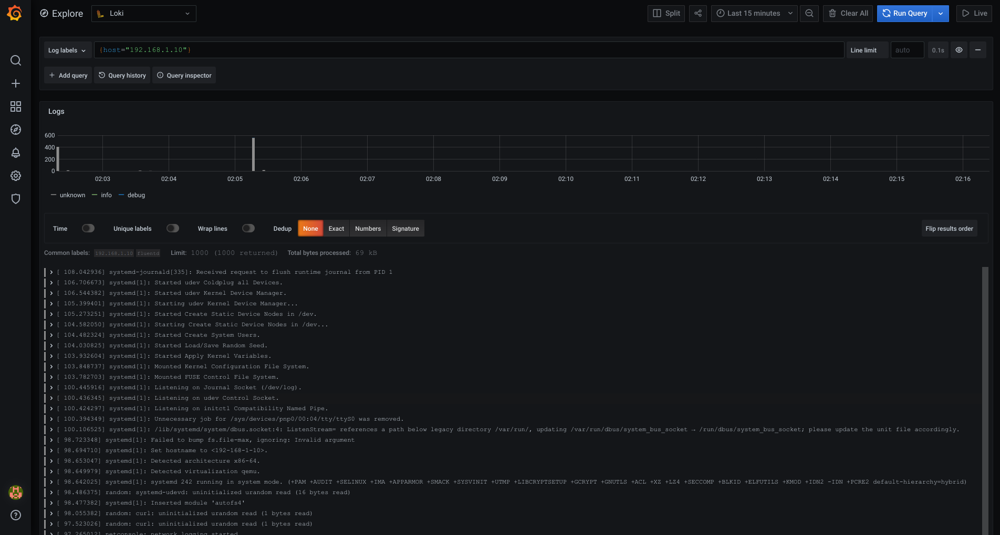

**Message from the Maintainer: Due to some priority changes in my life I am not able to put as much effort in here as needed. Some things might be broken. For 2021 a major rehaul is planned and prepared in the background. Helping hands are always welcome.**

## Coinboot [](https://travis-ci.com/frzb/coinboot)

Coinboot is a framework for **diskless** computing.   

Coinboot was initially made to run **GPU**-based **blockchain hashing** on mining farms with a **minimal TCO**.  
Coinboot can also be used to run various other number crunching workloads like  
**video rendering** or **machine learning**  with a **minimal TCO**.  


Its core features are:

* **Running Diskless**

  With Coinboot there is no need to equip machines with storage media like SSDs, HDDs or USB flash drives.  
  All machines are booting the operating system over network and run completely from memory, in-memory.


* **Lightweight Footprint**

  Coinboot has a lightweight footprint.  
  Driven by the demand to run sufficiently on hundreds of machines with commodity 1 Gbit/s network hardware.


* **Familiar Usability**

  No bumpy ride.  
  Coinboot feels just like every other Debian/Ubuntu-based system. 


* **Easy Expandability**

  Need to expand your worker nodes with further configuration, software, libraries, proprietary drivers?  
  By packing them as Coinboot plugin you can use them right after your machines have booted.  
  Without the overhead caused by configuration managment or running complex orchestration infrastructure.  


* **Insights out of the box**  

  Coinboot comes with [Loki](https://grafana.com/oss/loki/) integrated for log managment.   
  Providing the log files of your worker nodes at a glance.

This repository contains the Coinboot Server Docker container.                 
This container includes all services to get Coinboot up and running and boot diskless Coinboot Worker nodes over network.

### Talk at All Systems Go! 2019 conference

#### Coinboot - Cost effective, diskless GPU clusters for blockchain hashing and beyond

[](http://www.youtube.com/watch?v=6T9pBa9I_AQ "Coinboot - Cost effective, diskless GPU clusters for blockchain hashing and beyond")

## Requirements

Docker 18.06.0-ce

Docker Compose 1.25.0 

## Usage

### Quickstart

Clone this repository on the host where you want to execute the Coinboot Docker container.

#### IP address and network

Take care that your Docker host has assigned an IP address matching to the `dhcp-range` specified at `./conf/dnsmasq/coinboot.conf`.  
For example the Docker host has assigned `192.168.1.2` then a matching DHCP-range configuration is: `dhcp-range=192.168.1.10,192.168.1.100,6h`.  
Also verify that the network adapter you assigned this IP address on your Docker host is connected to the same L2/broadcast domain as the machines you want to boot with Coinboot.  

#### Environment variables

You can hand over environment variables to the worker nodes booting with Coinboot.  
This way you can keep the configuration of your Coinboot Worker nodes at one point.  
Just put these variables in a file in the directory `./conf/environment/`.  
These variables are added to `/etc/environment` on the worker nodes during boot and are exported and available for login shells on these nodes.  
If these variables are not exported and available, e.g. in Systemd units, just source the file `/etc/environment` to make them available.  

There are also mandatory environment variables which are required to be configured.

#### Mandatory environment variables

| Variable             | Default       | Description                                                            |
| -------------------- |:-------------:| -----------------------------------------------------------------------|
| `COINBOOT_SERVER_IP` | `192.168.1.2` | IP address at which the services of the Coinboot server should listen. |


#### RootFS and Kernel

The RootFS and Kernel are downloaded autmatically when the Coinboot Server Docker container is started based on the `RELEASE`set at `./conf/environment/default.env`. Out of the box the latest available release is used.

You can **build** your own Coinboot base image using: [coinboot-debirf](https://github.com/frzb/coinboot/tree/master/debirf).   
Or **download** a pre-build daily release at: https://github.com/frzb/coinboot/releases  
These builds are made daily to contain all current packages updates and security fixes.
The RootFS (`*initramfs*`) and Kernel (`*vmlinuz*`) you want to use are to be placed in the directory `./boot`.

#### Plugins

Coinboot plugins should be placed into  the directory `./plugins`

You can create your own plugins (see below) or pick some at: https://coinboot.io/plugins

#### DHCP configuration

Put your own `dnsmasq` DHCP server configuration in `./conf/dnsmasq/` or edit the existing configuration file `./conf/dnsmasq/coinboot.conf`.

In the most  cases you should only need  to configure: 

* DHCP lease range
* DNS server
* Default network gateway


#### IP address and network

Take care that your Docker host has assigned an IP address matching to the `dhcp-range` specified at `./conf/dnsmasq/coinboot.conf`. 

For example the Docker host has assigned `192.168.1.2` then a matching DHCP-range configuration is: `dhcp-range=192.168.1.10,192.168.1.100,6h`. 

Also verify that the network adapter you assigned this IP address on your Docker host is connected to the same L2/broadcast domain as the machines you want to boot with Coinboot.

### Start the Coinboot Server Docker container

Just bring the Coinboot Server Docker and Graylog containers up with `docker-compose`.

```
$ docker-compose up -d
```

### Boot your worker nodes with Coinboot

Start your worker nodes.  
After they have booted Coinboot over network you can login to your machines over `ssh`.  
Default credentials are:

* login: `ubuntu`
* password: `ubuntu`
  
Please change the password via creating a Coinboot Plugin.

### Logfiles

To see what's currently going on you can look at the logfiles of the Coinboot Docker container.  
For instance to see the DHCP lease hand-shakes happen or what plugins are delivered.

```
$ docker-compose logs -f coinboot
```

### Centralized log managment with Loki

Coinboot comes with Loki as centralized log management collecting iPXE bootloader and Kernel message of all your worker nodes.  



Login with your web browser at the preconfigured Grafana instance: http://<your-Docker-host-IP:3000>`
  
* login `admin`    

* password: `admin`

Change the initial password as suggested by Grafana.   

Get to the Explore section and select the worker node by `host` label to browse the log files of individual worker nodes.  
For more details about the usage of the Grafana Explore for exploring log files please refer to the [logs](https://grafana.com/docs/grafana/latest/explore/#logs-integration) section of the Grafana Explore documentation.

## Test and development environment

There is Vagrant environment for developing purposes.
It consists of two Vagrant machines: One with the the Coinboot Server Docker container and one machine acting as worker node, which boots over PXE.

To spin up the Vagrant machines execute:

```
$ vagrant up
```

## Pack your own Coinboot plugins

A Coinboot plugin is the way to go to extend the functionality of machines that boot with Coinboot.  
Basically a Coinboot plugin is just set of file system changes that is applied at boot time.  

Clone the https://github.com/frzb/coinboot-plugins repository to get `coinbootmaker`.

```
$ git clone git@github.com:frzb/coinboot-plugins.git
``` 
### `coinbootmaker`

```
Usage: coinbootmaker [-i] -p <file name> <path to initramfs>

-i              Interactive mode - opens a shell in the build environment
-p <file name>  Plugin to build
-h              Display this help
``` 

### Example

Run `coinbootmaker` interactivly (`-i`)

```
$ ./coinbootmaker -i /tmp/coinboot-initramfs-4.15.0-43-generic 
```

* You are entering the build environment

* Execute `$ create_plugin.py start `

* Do your changes to the system - e.g. install packages and edit configuration files.

* When your are done: Execute `$ create_plugin.py finish <name-of-your-plugin>`

* Place the created plugin archive into `./plugins` on the host where you run the Coinboot Docker container

Up on the next boot the changes your made in your plugin are ready to be used on your Coinboot machines!

Creation of plugins can also be scripted. Just do whatever you want to do between the lines `$ create_plugin.py start` and `$ create_plugin.py finish <name-of-your-plugin>`.

For more details about creating plugins and example plugins please refer to https://github.com/frzb/coinboot-plugins .
## License

GNU GPLv3 

## Author

Gunter Miegel 
gm@coinboot.io

## Contribution

Fork this repo. Use the test- and development environment provided.
Make a pull request to this repo. 
